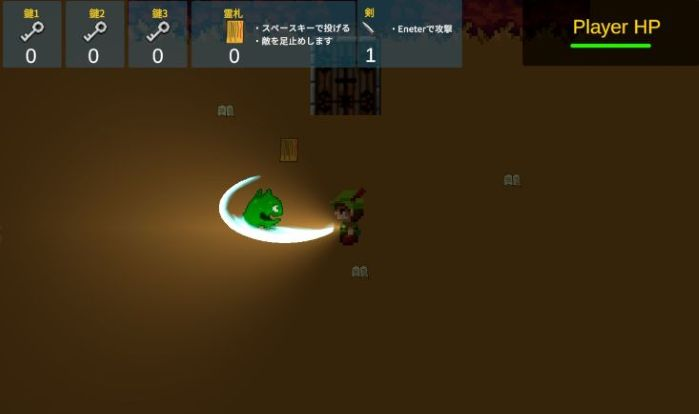

## Battle Of Darknessについて
プレイヤーを操作して敵を倒しながら脱出を目指す2Dゲームです。
ライトを取得して、鍵を集め扉からの脱出を目指しましょう。

## ゲームプレイ方法
[ゲームのサンプルプレイ](https://rune337.github.io/BattleofDarkness_Build/) 

### 操作方法
* Aキー (左キー) :左に移動
* Dキー (右キー) :右に移動
* Wキー (上キー) :上に移動
* Sキー (下キー) :下に移動
* スペースキー :霊札を所持した状態で押すとプレイヤーの向きに投げる、敵を足止め
* エンターキー :剣を所持した状態で押すと攻撃
* Eキー :本アイコンや扉アイコンで押すとテキストを持つオブジェクトはテキスト表示

### ゲームルール
* 画面右上のPlayerのHPがゼロになるとゲームオーバー
* 敵は霊札で足止め、剣でダメージを与え倒すことができる
* ダミーの扉と本物の扉があり、本物の扉のみ扉に合うカギを持っていれば開く。

* ## 使用技術
* ゲームエンジン：Unity
* 使用言語：C#
* 使用ツール：VisualStudio、CLIP STUDIO PAINT

## 開発の工夫
* 開発期間：30時間
* 担当範囲：プログラミング、デバッグ仕上げ
* こだわった点：
角度を取得して斜めにもう移動できるようにしました。
扉と消費アイテムの出現位置がランダムになるようにしました。
敵を攻撃して倒せるようにしました。
* 技術的な調整：
プレイヤーの向きに霊札と斬撃が出るように調整しました。
